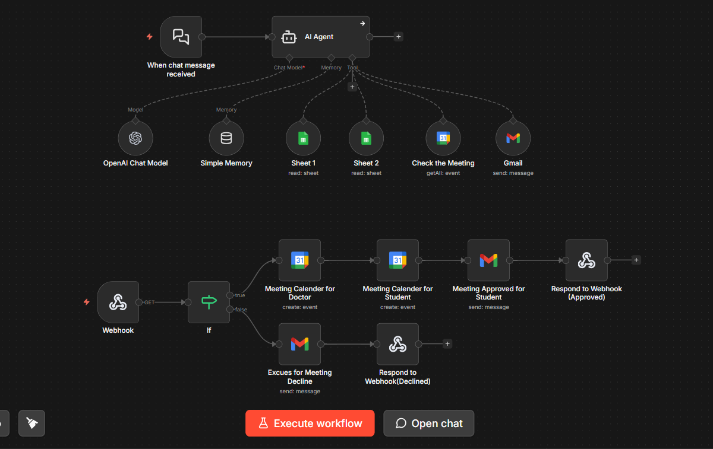

# 🎓 University Doctor's Booking Agent

This project is a sophisticated **AI-driven Automation System** built with **n8n**. It streamlines the process of scheduling academic office hours between students and professors at the **Faculty of IT**. By leveraging Natural Language Processing (NLP), the system provides a seamless, conversational booking experience.

### 🎯 Purpose
The primary goal of this system is to bridge the communication gap between students and professors by automating the appointment scheduling process. It eliminates the manual back-and-forth of emails, ensures no time-slot conflicts, and provides a professional, organized way for students to secure office hour meetings, ultimately saving time for both faculty and students.

### 🚀 How It Works
1.  **Smart Interaction**: The student initiates a chat. The AI uses **Fuzzy Matching** to identify the correct professor even if the student makes minor spelling mistakes.
2.  **Dynamic Retrieval**: The system fetches real-time office hours from Google Sheets and presents them to the student.
3.  **Conflict Validation**: Before proceeding, the agent cross-references the requested time with the professor's Google Calendar to ensure no overlapping meetings exist.
4.  **One-Click Approval**: An interactive email is sent to the professor with **Accept/Decline** buttons.
5.  **Finalization**:
    * **On Approval**: The meeting is automatically booked in both the professor's and student's calendars, and a confirmation email is sent.
    * **On Decline**: The student is notified to choose an alternative slot.

### 📋 Key Features
* **Back-end First Architecture**: Focused on robust API logic and system reliability.
* **Timezone Optimized**: Fully configured for **Jordan Time (GMT+3)** to prevent scheduling errors.
* **Zero-Touch Automation**: Once deployed, the system manages the entire lifecycle of a booking request without human intervention.

### 🛠️ Tools Used
* **n8n**: The core low-code automation platform used to orchestrate the entire workflow.
* **OpenAI (GPT-4o-mini)**: The advanced LLM used to power the AI Agent for natural language understanding and decision-making.
* **Google Sheets**: Used as a dynamic database to store professor profiles and office hour schedules.
* **Google Calendar**: Integrated for real-time availability checks and automated meeting scheduling.
* **Gmail**: Used to handle the interactive approval system for professors and automated student notifications.
* **Webhooks**: Used to trigger the workflow and manage real-time responses from professor emails.